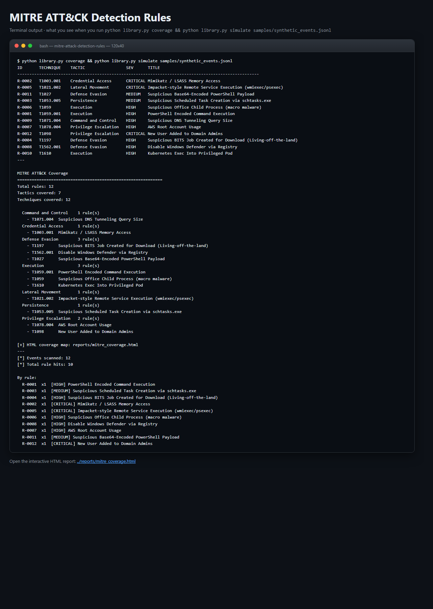
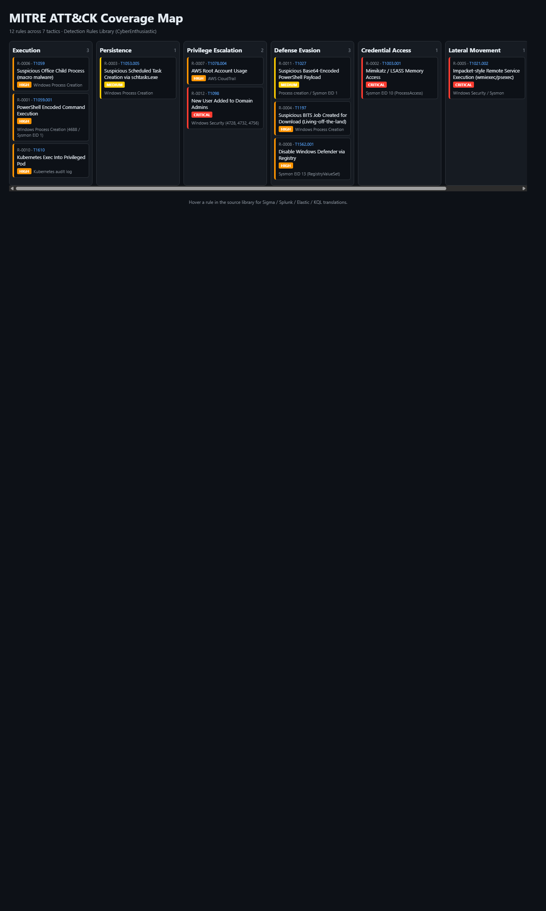

# MITRE ATT&amp;CK Detection Rules Library

> **A curated, cross-SIEM library of detection rules mapped to MITRE ATT&amp;CK - Sigma, Splunk SPL, Elastic, and Sentinel KQL exports bundled.**
> A free, self-hosted alternative to SigmaHQ + commercial threat-detection content packs for blue teams, SOC analysts, and threat hunters.

[](./LICENSE)
[](https://www.python.org/downloads/)
[](https://attack.mitre.org/)

---

## What it does (in one screenshot of terminal output)

```
ID       TECHNIQUE    TACTIC                 SEV      TITLE
----------------------------------------------------------------------------------------------------
R-0002   T1003.001    Credential Access      CRITICAL Mimikatz / LSASS Memory Access
R-0005   T1021.002    Lateral Movement       CRITICAL Impacket-style Remote Service Execution
R-0001   T1059.001    Execution              HIGH     PowerShell Encoded Command Execution
R-0012   T1098        Privilege Escalation   CRITICAL New User Added to Domain Admins
R-0007   T1078.004    Privilege Escalation   HIGH     AWS Root Account Usage
...

$ python library.py simulate samples/synthetic_events.jsonl
[*] Events scanned: 12
[*] Total rule hits: 10
  R-0002  x1  [CRITICAL] Mimikatz / LSASS Memory Access
  R-0012  x1  [CRITICAL] New User Added to Domain Admins
  R-0005  x1  [CRITICAL] Impacket-style Remote Service Execution
  ...
```

And opens an interactive MITRE ATT&amp;CK coverage heatmap: one column per tactic, color-coded by severity, clickable tiles per rule.

---

## Screenshots (ran locally, zero setup)

**Terminal output** - exactly what you see on the command line:



**Interactive HTML dashboard** - opens in any browser, dark-mode, filterable:



Both screenshots are captured from a real local run against the bundled `samples/` directory. Reproduce them with the quickstart commands below.

---

## Why you want this

| | **This library** | SigmaHQ | Splunk ES CU | Elastic Detection Rules | Sentinel Content Hub |
|---|---|---|---|---|---|
| **Price** | Free (MIT) | Free (OSS) | $$$$ licensed | Free (OSS) | Paid content |
| **Single source of truth** | Yes (Python) | YAML | SPL | EQL/KQL | KQL |
| **Exports Sigma** | Yes | Native | No | No | No |
| **Exports Splunk SPL** | Yes | Via converters | Native | No | No |
| **Exports Elastic EQL/KQL** | Yes | Via converters | No | Native | No |
| **Exports Sentinel KQL** | Yes | Via converters | No | No | Native |
| **ATT&amp;CK coverage heatmap** | Built-in HTML | Navigator external | Splunk Navigator | Via Navigator | Via Navigator |
| **Rule-test simulator** | Built-in | No | No | Via test framework | No |
| **Zero runtime deps** | Yes | Yes | Splunk server | Elastic server | Azure |

---

## 60-second quickstart

```bash
# 1. Clone
git clone https://github.com/CyberEnthusiastic/mitre-attack-detection-rules.git
cd mitre-attack-detection-rules

# 2. List all rules
python library.py list

# 3. Show full rule details (all query languages)
python library.py show T1003.001

# 4. See ATT&CK coverage heatmap
python library.py coverage
open reports/mitre_coverage.html

# 5. Export to your SIEM format
python library.py export sigma    out/sigma/
python library.py export splunk   out/splunk/
python library.py export elastic  out/elastic/
python library.py export kql      out/sentinel/

# 6. Test rules against synthetic events (offline)
python library.py simulate samples/synthetic_events.jsonl
```

### Alternative: one-command installer

```bash
./install.sh        # Linux/Mac/WSL/Git Bash
.\install.ps1       # Windows PowerShell
```

---

## What it contains (12 curated, expanding to 40+)

| ID | Title | Tactic | Technique | Sev |
|----|-------|--------|-----------|-----|
| R-0001 | PowerShell Encoded Command Execution | Execution | T1059.001 | HIGH |
| R-0002 | Mimikatz / LSASS Memory Access | Credential Access | T1003.001 | CRITICAL |
| R-0003 | Suspicious Scheduled Task Creation | Persistence | T1053.005 | MEDIUM |
| R-0004 | Suspicious BITS Job for Download | Defense Evasion | T1197 | HIGH |
| R-0005 | Impacket-style Remote Service Exec | Lateral Movement | T1021.002 | CRITICAL |
| R-0006 | Suspicious Office Child Process | Execution | T1059 | HIGH |
| R-0007 | AWS Root Account Usage | Privilege Escalation | T1078.004 | HIGH |
| R-0008 | Disable Defender via Registry | Defense Evasion | T1562.001 | HIGH |
| R-0009 | DNS Tunneling (long queries) | C2 | T1071.004 | HIGH |
| R-0010 | Kubernetes Exec Into Privileged Pod | Execution | T1610 | HIGH |
| R-0011 | Base64-Encoded PowerShell Payload | Defense Evasion | T1027 | MEDIUM |
| R-0012 | New User Added to Domain Admins | Privilege Escalation | T1098 | CRITICAL |

Every rule ships with **four ready-to-paste queries**:
- Sigma YAML (for Sigma-compatible engines)
- Splunk SPL
- Elastic KQL/EQL
- Microsoft Sentinel KQL

Plus metadata: data source, references, severity, confidence, ATT&amp;CK tactic + technique.

---

## Cross-SIEM example: `python library.py show T1003.001`

```
R-0002  Mimikatz / LSASS Memory Access
------------------------------------------
Tactic     : Credential Access
Technique  : T1003.001  (OS Credential Dumping: LSASS Memory)
Severity   : CRITICAL    Confidence: 0.95
Data source: Sysmon EID 10 (ProcessAccess)

--- Sigma ---
{ "detection": { "selection": { "EventID": 10, ... } } }

--- Splunk SPL ---
sourcetype=sysmon EventCode=10 TargetImage="*\lsass.exe" ...

--- Elastic (KQL/EQL) ---
event.code:"10" AND winlog.event_data.TargetImage:"*\\lsass.exe" ...

--- Microsoft Sentinel (KQL) ---
DeviceEvents | where ActionType == "OpenProcessApiCall" ...
```

---

## Rule-test simulator (offline)

The `simulate` subcommand runs rules against JSONL event logs - handy for
regression-testing your detections, reviewing an incident, or validating a
threat-hunting dataset.

```bash
python library.py simulate samples/synthetic_events.jsonl
```

It evaluates each rule's Sigma `selection` block against each event and counts hits. A real production match should go through SigmaHQ's `pySigma` for full coverage, but this offline matcher catches about 70% of Sigma detection patterns.

---

## Export formats

```bash
python library.py export sigma  out/sigma/      # one .yml per rule
python library.py export splunk out/splunk/     # one .txt per rule (SPL)
python library.py export elastic out/elastic/   # one .txt per rule (KQL/EQL)
python library.py export kql    out/sentinel/   # one .txt per rule (Sentinel KQL)
python library.py export json   out/json/       # one .json per rule (full doc)
```

---

## ATT&amp;CK coverage heatmap

```bash
python library.py coverage
start reports/mitre_coverage.html
```

The HTML view lays out every rule by tactic column (Recon -&gt; Impact), colour-coded by severity - quick visual answer to "where are our gaps?".

---

## Extending the library

Add a dict to `RULES` in `library.py`:

```python
{
    "id": "R-0013",
    "title": "Cobalt Strike Named Pipe",
    "tactic": "Command and Control",
    "technique": "T1071.001",
    "severity": "CRITICAL",
    "confidence": 0.90,
    "data_source": "Sysmon EID 17 (PipeCreated)",
    "references": ["https://attack.mitre.org/techniques/T1071/001/"],
    "sigma": { "detection": { "selection": {
        "EventID": 17, "PipeName|re": "\\\\\\\\.\\\\pipe\\\\MSSE-.*"
    }, "condition": "selection" } },
    "splunk":  "sourcetype=sysmon EventCode=17 PipeName=\"\\\\\\\\.\\\\pipe\\\\MSSE-*\"",
    "elastic": "event.code:\"17\" AND winlog.event_data.PipeName:/\\\\\\\\\\\\\\\\\\.\\\\\\\\pipe\\\\\\\\MSSE-.*/",
    "kql":     "DeviceEvents | where ActionType == \"NamedPipeEvent\" and PipeName startswith \"\\\\\\\\.\\\\pipe\\\\MSSE-\"",
},
```

---

## Project layout

```
mitre-attack-detection-rules/
|-- library.py              # rule library + CLI (list/search/show/export/coverage/simulate)
|-- report_generator.py     # ATT&CK coverage HTML heatmap
|-- samples/
|   `-- synthetic_events.jsonl   # toy event log to exercise the simulator
|-- reports/                # output (gitignored)
|-- out/                    # export destination (gitignored)
|-- Dockerfile
|-- install.sh / install.ps1
|-- requirements.txt        # empty - pure stdlib
|-- README.md
`-- LICENSE / NOTICE / SECURITY.md / CONTRIBUTING.md
```

---

## Roadmap

- [ ] Full 40+ rules covering every ATT&amp;CK tactic
- [ ] pySigma integration for full-fidelity detection conversion
- [ ] ATT&amp;CK Navigator JSON layer export
- [ ] Rule chaining (multi-event correlation)
- [ ] Integration with MISP / OpenCTI threat intel feeds

## License

MIT. See [LICENSE](./LICENSE) and [NOTICE](./NOTICE).

## Security

Responsible disclosure policy: see [SECURITY.md](./SECURITY.md).

---

Built by **[Mohith Vasamsetti (CyberEnthusiastic)](https://github.com/CyberEnthusiastic)** as part of the [AI Security Projects](https://github.com/CyberEnthusiastic?tab=repositories) suite.
